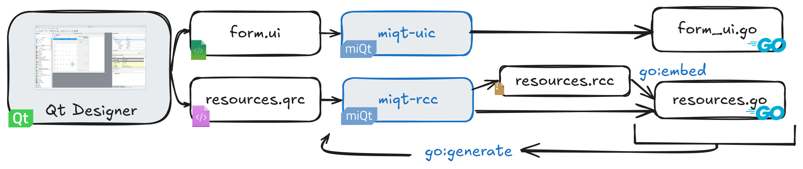
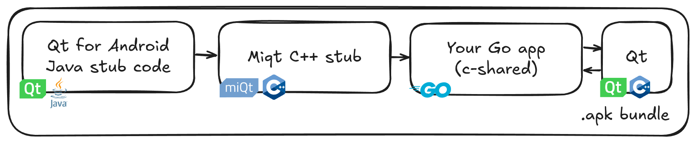

[](https://pkg.go.dev/github.com/mappu/miqt/qt)
[](https://github.com/mappu/miqt/actions)
[](https://goreportcard.com/report/github.com/mappu/miqt)


# MIQT

MIQT is MIT-licensed Qt bindings for Go.

This is a straightforward binding of the Qt 5.15 / Qt 6.4+ API using CGO. You must have a working Qt C++ development toolchain to use this Go binding.

These bindings were newly started in August 2024. The bindings are complete for QtCore, QtGui, QtWidgets, QtMultimedia, QtMultimediaWidgets, QtSpatialAudio, QtPrintSupport, QtSvg, QtScript, QtNetwork, QtWebkit, QtWebChannel, QtWebEngine, QtCharts, QML, QScintilla, ScintillaEdit, there is subclassing support, and there is a uic/rcc implementation. But, the bindings may be immature in some ways. Please try out the bindings and raise issues if you have trouble.

## Supported platforms

|OS|Arch|Linkage|Status
|---|---|---|---
|Linux|x86_64|Static or Dynamic (.so)|✅ Works
|Linux|ARM64|Static or Dynamic (.so)|✅ Works
|Windows|x86_64|Static or Dynamic (.dll)|✅ Works
|Android|ARM64|Dynamic (bundled in .apk package)|✅ Works
|FreeBSD|x86_64|Static or Dynamic (.so)|✅ Works
|macOS|x86_64|Static or Dynamic (.dylib)|✅ Works
|macOS|ARM64|Static or Dynamic (.dylib)|Should work, not tested

## License

The MIQT Go bindings are licensed under the MIT license.

You must also meet your Qt license obligations.

## Made with MIQT

These apps are listed in alphabetical order. Raise an issue or PR to have your app listed here!

- [annie-miqt](https://code.ivysaur.me/annie-miqt), a GUI application for downloading videos.
- [jqview](https://github.com/rcalixte/jqview), The simplest possible native GUI for inspecting JSON objects with jq
- [libqt6zig](https://github.com/rcalixte/libqt6zig), Qt bindings for Zig and C based on MIQT
- [mdoutliner](https://github.com/mappu/miqt/tree/master/examples/mdoutliner), Markdown Outliner sample application
- [qbolt](https://code.ivysaur.me/qbolt), a graphical database manager for BoltDB
- [qocker-miqt](https://code.ivysaur.me/qocker-miqt), a user-friendly GUI application for managing Docker containers
- [seaqt](https://github.com/seaqt/nim-seaqt), Qt bindings for Nim and C based on MIQT
- See more users of the [qt5](https://pkg.go.dev/github.com/mappu/miqt/qt?tab=importedby) or [qt6](https://pkg.go.dev/github.com/mappu/miqt/qt6?tab=importedby) packages

## FAQ

### Q1. Why are the binaries so big?

Make sure to compile with `go build -ldflags "-s -w"`. This reduces the `helloworld` example from 43MB to 6MB.

Then, it's possible to reduce the size further with `upx --best` to 2MB or `upx --lzma` to 1.4MB.

You can also try `miqt-docker native -minify-build` to use aggressive `CFLAGS`.

### Q2. Can I release a proprietary, commercial app with this binding?

Yes. You must also meet your Qt license obligations: either use Qt dynamically-linked dll/so/dylib files under the LGPL, or, purchase a Qt commercial license for static linking.

### Q3. Why does it take so long to compile?

The first time MIQT is used, your `go build` would take [about 10 minutes](https://github.com/mappu/miqt/discussions/65). But after that, any `go build` is very fast.

If you are compiling your app within a Dockerfile, you could cache the build step by running `go install github.com/mappu/miqt/qt`.

If you are compiling your app with a one-shot `docker run` command, the compile speed can be improved if you also bind-mount the Docker container's `GOCACHE` directory: `-v $(pwd)/container-build-cache:/root/.cache/go-build`. The `miqt-docker` helper app does this automatically.

See also [issue #8](https://github.com/mappu/miqt/issues/8).

### Q4. How does this compare to other Qt bindings?

MIQT is a clean-room binding that does not use any code from other Qt bindings.

- [therecipe/qt](https://github.com/therecipe/qt) is the most mature Qt binding for Go.
	- By default, it works by making IPC calls to a separate C++ binary downloaded at runtime from a site under the maintainer's control. This may be less performant than calling Qt directly.
	- It does not support Go Modules, nor Qt 6
	- Because of the LGPL license, it's [extremely difficult to make a proprietary app](https://github.com/therecipe/qt/wiki/FAQ#can-i-make-a-proprietary-app-with-this-binding-). See also their [issue 259](https://github.com/therecipe/qt/issues/259).
- [kitech/qt.go](https://github.com/kitech/qt.go) is another mature Qt binding for Go.
	- Unfortunately, it's also using the LGPL license. It also does not support Qt 6.
- [go-qamel/qamel](https://github.com/go-qamel/qamel) is an MIT-licensed Qt binding for Go.
	- Unfortunately, it only supports QML, not Qt Widgets.

### Q5. How does the MIQT Go API differ from the official Qt C++ API?

Most functions are implemented 1:1. [The Qt documentation](https://doc.qt.io/qt-5/classes.html) should be used.

The `QByteArray`, `QString`, `QList<T>`, `QVector<T>`, `QMap<K,V>`, `QHash<K,V>` types are projected as plain Go `[]byte`, `string`, `[]T`, and `map[K]V`. Therefore, you can't call any of the Qt type's methods, you must use some Go equivalent method instead.

- Go strings are internally converted to QString using `QString::fromUtf8`. Therefore, the Go string must be UTF-8 to avoid [mojibake](https://en.wikipedia.org/wiki/Mojibake). If the Go string contains binary data, the conversion would corrupt such bytes into U+FFFD (�). On return to Go space, this becomes `\xEF\xBF\xBD`.

- The iteration order of a Qt QMap/QHash will differ from the Go map iteration order. QMap is iterated by key order, but Go maps and QHash iterate in an undefined internal order.

Where Qt returns a C++ object by value (e.g. `QSize`), the binding may have moved it to the heap, and in Go this may be represented as a pointer type. In such cases, a Go finalizer is added to automatically delete the heap object. This means code using MIQT can look basically similar to the Qt C++ equivalent code.

The `connect(sourceObject, sourceSignal, targetObject, targetSlot)` is projected as `targetObject.onSourceSignal(func()...)`.

- You can also override virtual methods like PaintEvent in the same way. Your callback `func()` receives `super()` as a first argument that can be used to call the base class implementation.

Qt class inherited types are projected as a Go embedded struct. For example, to pass a `var myLabel *qt.QLabel` to a function taking only the `*qt.QWidget` base class, write `myLabel.QWidget`.

- When a Qt subclass adds a method overload (e.g. `QMenu::addAction(QString)` vs `QWidget::addAction(QAction*)`), the base class version is shadowed and can only be called via `myQMenu.QWidget.AddAction(QAction*)`.

- A MIQT pointer points to a Go struct, not to the raw C++ Qt widget class. Therefore `QTabWidget.CurrentWidget() == MyTab` will never compare equal because `CurrentWidget()` created a new Go struct wrapping the same C++ pointer. You can compare `QTabWidget.CurrentIndex()`, or, you can use: `QTabWidget.CurrentWidget().UnsafePointer() == MyTab.UnsafePointer()`.

The Go runtime migrates goroutines between OS threads, but Qt expects fixed OS threads to be used for each QObject. When you first call `qt.NewQApplication` in MIQT, that will be considered the [Qt main thread](https://doc.qt.io/qt-6/thread-basics.html#gui-thread-and-worker-thread) and will automatically signal the Go runtime to bind to a fixed OS thread using `runtime.LockOSThread()`.

- When accessing Qt objects from inside another goroutine, it's safest to use `(qt6/mainthread).Wait()` to access the Qt objects from Qt's main thread.

Some C++ idioms that were difficult to project were omitted from the binding. But, this can be improved in the future.

### Q6. Can I use Qt Designer and the Qt Resource system?



MIQT has a custom implementation of Qt `uic` and `rcc` tools, to allow using [Qt Designer](https://doc.qt.io/qt-5/qtdesigner-manual.html) for form design and resource management. After running the `miqt-uic` and `miqt-rcc` tools once, you can rebuild any changes using the convenient `go generate` command.

### Q7. How can I point MIQT to use a custom Qt install location?

MIQT uses `pkg-config` to find all used Qt libraries. Every Qt library should have a definition file in `.pc` format, which provides CGO with the necessary `CXXFLAGS`/`LDFLAGS`. Your Qt development environment already included the necessary `.pc` definition files.

You can use the `PKG_CONFIG_PATH` environment variable to override where CGO looks for `.pc` files. [Read more »](doc/pkg-config.md)

### Q8. How can I upgrade a MIQT app from Qt 5 to Qt 6?

The import path changes from `github.com/mappu/miqt/qt` to `github.com/mappu/miqt/qt6`, but most basic classes are the same.

You can replace the import path in two ways:
1. Add a go.mod directive: Run `go mod edit -replace github.com/mappu/miqt/qt=github.com/mappu/miqt/qt6`
2. Or, update all imports: Run `find . -type f -name .go -exec sed -i 's_"github.com/mappu/miqt/qt"_qt "github.com/mappu/miqt/qt6"_' {} \;`

### Q9. How can I add bindings for another Qt library?

Fork this repository and add your library to the `genbindings/config-libraries` file. [Read more »](cmd/genbindings/README.md)

### Q10. Is there an easy build tool?

You can use the ordinary `go get` and `go build` commands. To help with cross-compilation, you can use the optional `miqt-docker` tool. [Read more »](cmd/miqt-docker/README.md)

## Building

### Linux (native)

*Tested with Debian 12 / Qt 5.15 + 6.4 / GCC 12*

*Tested with Fedora 40 + 41 / Qt 6.7 + 6.8 / GCC 14*

1. Install dependencies

For dynamic linking, with the system Qt (Qt 5):

```bash
# Debian / Ubuntu (Minimal)
apt install qtbase5-dev build-essential golang-go

# Debian / Ubuntu (Full)
apt install qtbase5-dev libqscintilla2-qt5-dev libqt5svg5-dev libqt5webchannel5-dev libqt5webkit5-dev qtbase5-private-dev qtmultimedia5-dev qtpdf5-dev qtwebengine5-dev qtwebengine5-private-dev build-essential golang-go
```

For dynamic linking, with the system Qt (Qt 6):

```bash
# Debian / Ubuntu (Minimal)
apt install qt6-base-dev build-essential golang-go

# Debian / Ubuntu (Full)
apt install qt6-base-dev libqscintilla2-qt6-dev qt6-base-private-dev qt6-charts-dev qt6-multimedia-dev qt6-pdf-dev qt6-svg-dev qt6-webchannel-dev qt6-webengine-dev qt6-declarative-dev qml6-module-qtquick-{controls,shapes,layouts,templates,window} build-essential golang-go

# Fedora
dnf install qt6-qtbase-devel qscintilla-qt6-devel qt6-qtcharts-devel qt6-qtmultimedia-devel qt6-qtpdf-devel qt6-qtsvg-devel qt6-qtwebchannel-devel qt6-qtwebengine-devel qt6-qtdeclarative-devel golang

# Manjaro
pamac install qt6-base qscintilla-qt6 qt6-charts qt6-multimedia qt6-svg qt6-webchannel qt6-webengine qt6-declarative go

# Arch Linux (Minimal)
pacman -S pkg-config gcc go qt6-base

# Arch Linux (Full)
pacman -S pkg-config gcc go qt6-base qscintilla-qt6 qt6-charts qt6-multimedia qt6-svg qt6-webchannel qt6-webengine qt6-declarative
```

2. Compile your application

```bash
go build -ldflags '-s -w'
```

### Windows (Docker with miqt-docker)

```bash
go install github.com/mappu/miqt/cmd/miqt-docker
miqt-docker win64-qt6-static -windows-build # or -qt5- or -static
```

### Windows (native)

*Tested with Fsu0413 Qt 5.15 / Clang 18.1 native compilation*

1. Install Go from [go.dev](https://go.dev/dl/).
2. Install some Qt toolchain and its matching GCC or Clang compiler (MSVC is not compatible with CGO).
	- You can use [official Qt binaries](https://www.qt.io/) or any LGPL rebuild.
	- Example: Download and extract the following into some shared `C:\dev\rootfs`:
	- [Qt and matching GCC or Clang toolchain](https://build-qt.fsu0413.me/5.15-series/5.15.11-for-windows/index.html#windows-mingw-llvm)
	- [pkg-config](https://sourceforge.net/projects/pkgconfiglite/files/0.28-1/)
3. Configure environment variables to allow it to be used:

```powershell
$env:CGO_ENABLED = 1
$env:CC = 'C:\dev\rootfs\bin\clang.exe'
$env:CXX = 'C:\dev\rootfs\bin\clang++.exe'
$env:PKG_CONFIG = 'C:\dev\rootfs\bin\pkg-config.exe'
$env:CGO_CXXFLAGS = '-Wno-ignored-attributes' # Clang 18 recommendation
```

4. Run `go build -ldflags "-s -w -H windowsgui"`

### Windows (MSYS2)

*Tested with MSYS2 UCRT64 Qt 5.15 / Qt 6.7 / GCC 14*

Install MSYS2 from [msys2.org](https://www.msys2.org/).

For dynamic linking:

```bash
# Install Go and C++ toolchains
pacman -S mingw-w64-ucrt-x86_64-{go,gcc,pkg-config}
export GOROOT=/ucrt64/lib/go # Needed only if this is the first time installing Go in MSYS2. Otherwise it would be automatically applied when opening a new Bash terminal.

# Install Qt
pacman -S mingw-w64-ucrt-x86_64-qt5-base # For Qt 5 (UCRT64 GCC toolchain)
pacman -S mingw-w64-ucrt-x86_64-qt6-base # For Qt 6 (UCRT64 GCC toolchain)
pacman -S mingw-w64-clang-x86_64-qt6-base # For Qt 6 (CLANG64 toolchain)

go build -ldflags "-s -w -H windowsgui"
```

- Note: the MSYS2 `qt5-base` package [is built to use `libicu`](https://github.com/msys2/MINGW-packages/blob/master/mingw-w64-qt5-base/PKGBUILD#L241), whereas the Fsu0413 Qt packages are not. [ICU is included by default with Windows 10 1703 and later](https://devblogs.microsoft.com/oldnewthing/20210527-00/?p=105255). If you are targeting older versions of Windows, then when using MSYS2, your distribution size including `.dll` files will be larger.

For static linking:

Static linking is also available by installing the `mingw-w64-ucrt-x86_64-qt5-static` package and building with `--tags=windowsqtstatic`. The static build will also be smaller as it [does not link to `libicu`](https://github.com/msys2/MINGW-packages/blob/master/mingw-w64-qt5-static/PKGBUILD#L280).

### Windows (Docker)

*Tested with MXE Qt 5.15 / MXE GCC 5, and MXE Qt 6.8 / MXE GCC 11 under cross-compilation*

For static linking:

1. Build the necessary docker container for cross-compilation:
	- `docker build -t miqt/win64-cross:latest -f docker/win64-cross-go1.23-qt5.15-static.Dockerfile .`
2. Build your application:
	- `docker run --rm -v $(pwd):/src -w /src miqt/win64-cross:latest go build --tags=windowsqtstatic -ldflags '-s -w -H windowsgui'`

For dynamic linking:

1. Build the necessary docker container for cross-compilation:
	- `docker build -t miqt/win64-dynamic:latest -f docker/win64-cross-go1.23-qt5.15-dynamic.Dockerfile .`
2. Build your application:
	- `docker run --rm -v $(pwd):/src -w /src miqt/win64-dynamic:latest go build -ldflags '-s -w -H windowsgui'`
3. Copy necessary Qt LGPL libraries and plugin files.

See FAQ Q3 for advice about docker performance.

To add an icon and other properties to the .exe, you can use [the go-winres tool](https://github.com/tc-hib/go-winres). See the `examples/windowsmanifest` for details.

### FreeBSD (native)

*Tested with FreeBSD 14.2 / Go 1.21 / Qt 6.7 / Clang*

```bash
pkg install git
pkg install devel/pkgconf
pkg install go
pkg install qt6-base qt6-charts qt6-multimedia qt6-pdf qt6-svg qt6-webchannel qt6-webengine qt6-declarative qscintilla2-qt6

go build -ldflags '-s -w'
```

### macOS (Homebrew)

*Tested with macOS 12.6 "Monterey" x86_64 / Go 1.23 / Qt 5.15 / Apple Clang 14.0*

Install Homebrew from [brew.sh](https://brew.sh/).

For dynamic linking:

```bash
xcode-select --install
brew install golang
brew install pkg-config
brew install qt@5
go build -ldflags '-s -w'
```

Installing `qt@5` from Homebrew may be very slow if Homebrew chooses to do a from-source build instead of a binary Bottle build, particularly owing to QtWebEngine (Chromium).

### macOS (Docker)

*Tested with osxcross 14.5 / Go 1.19 / MacPorts Qt 5.15 / Debian Clang 14.0*

For dynamic linking:

1. Build the necessary docker container for cross-compilation:
	- `docker build -t miqt/osxcross:latest -f docker/macos-cross-x86_64-sdk14.5-go1.19-qt5.15-dynamic.Dockerfile .`
2. Build your application:
	- `docker run --rm -v $(pwd):/src -w /src miqt/osxcross:latest go build -ldflags '-s -w'`
3. Copy necessary Qt LGPL libraries and plugin files.

See FAQ Q3 for advice about docker performance.

### Android (Docker with miqt-docker)

*Tested with Raymii Qt 5.15 / Android SDK 31 / Android NDK 22 and with Qt.io Qt 6.6 / Android SDK 33 / Android NDK 25*

MIQT supports compiling for Android. Some extra steps are required to bridge the Java, C++, Go worlds.



```bash
go install github.com/mappu/miqt/cmd/miqt-docker
miqt-docker android-qt5 -android-build # or android-qt6
```

This produces a `.apk` in the current directory. A default manifest, icon, and keystore will be created. If you customize the `AndroidManifest.xml` file or images, they will be used for the next build.

Advanced users may customize the build process or manually invoke `androiddeployqt`. You can invoke it inside the container environment via `miqt-docker android-qt5 androiddeployqt ...`. For more information, see the `android-build.sh` file that `miqt-docker` is running.
