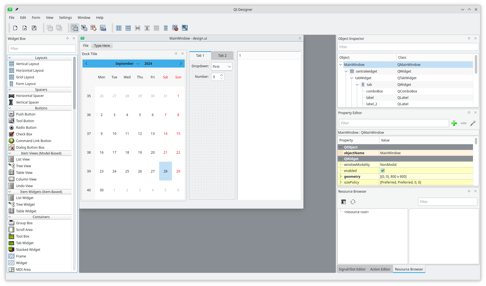
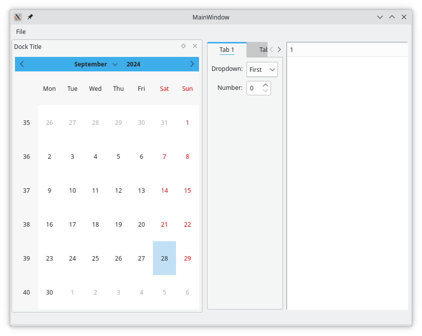

# miqt/examples/uidesigner

This example shows how to use [Qt Designer](https://doc.qt.io/qt-5/qtdesigner-manual.html) and miqt-uic to design a UI.

## 1. Design

Use Qt Designer to build the UI and save as a `.ui` XML file.



## 2. Compile

Compile the `.ui` XML to Go code with the `miqt-uic` tool.

```bash
miqt-uic -InFile design.ui -OutFile design.go
```

Some advanced configuration for `miqt-uic` can be done with other command-line arguments. Run `miqt-uic -Help` for more information.

## 3. Use

Use the generated types.


